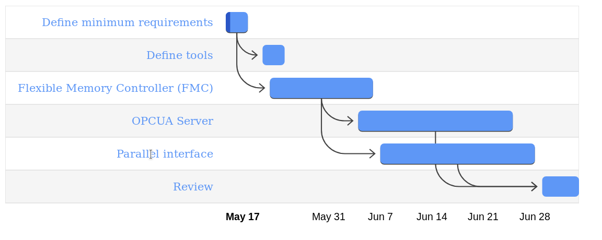

# uC-ST-DPHN
This is a repository to develop the main firmware of the ST uC for DAPHNE 

## Gannt Diagram

**TODO**
ST micro-controller:
- [ ] Define software document for ST
minimum requirements
- [ ] Define programming tools (List to study)
Will it be programmed by the use of the Zephyr library?
Which module will use the FMC?
Is mandatory its use because of the hardware?
Which modules are mandatory and which are the restrictions?

- [ ] Define the architecture of the firmware (Diagram)

- [ ] Define responsibilities

- [ ] Make documentation
